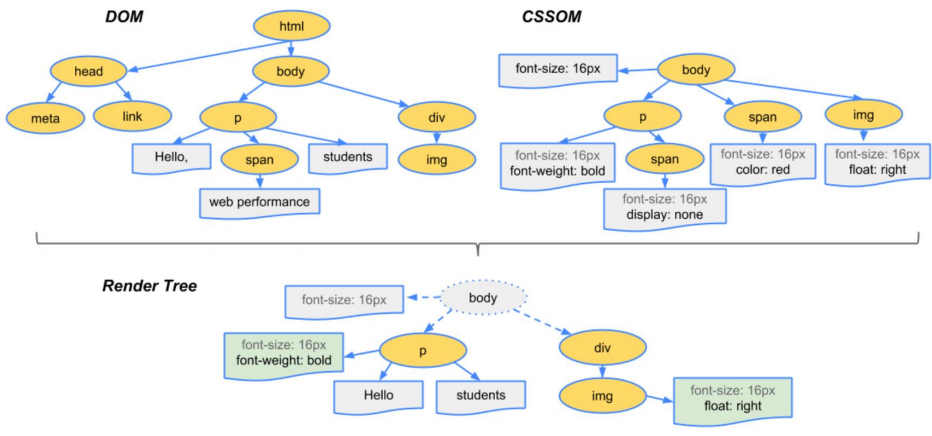
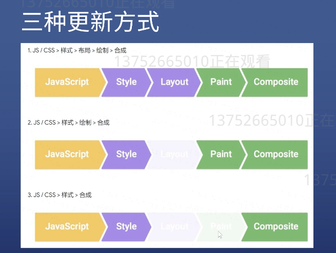

# CSS知识总结

## CSS布局

布局分类：

* 固定宽度布局，一般宽度为960/1000/1024
* 不固定宽度布局，主要靠文档流原理布局
* 响应式布局（混合布局）pc端固定，手机不固定

### float布局

* 子元素加上float:left或者float:right
* 在其父元素上必须加上clearfix
```CSS
.clearfix::after { 
    content:' '; display:block; clear:both; 
    }
```
### flex布局

操作方便，布局简单，移动端应用广泛

flex意为弹性布局，通过给父盒子添加flex属性，来控制子盒子的位置和排列方式，用来为盒状模型提供最大的灵活性，任何一个容器都可以指定为flex布局

### flex布局父项常见属性

* flex-direction：设置主轴的方向
* justify-content：设置主轴上的子元素的排列方式
* flex-wrap：设置子元素是否换行
* align-content：设置侧轴上的子元素的排列方式(多行)* 
* align-items：设置侧轴上的子元素排列方式(单行)
* flex-flow：复合属性，相当于同时设置了flex-direction和flex-wrap

flex具体学习可以参考阮一峰写的[教程](https://www.ruanyifeng.com/blog/2019/03/grid-layout-tutorial.html)

### grid布局（网格布局）

CSS Grid(网格) 布局（又称为 “Grid(网格)” ），是一个二维的基于网格的布局系统它的目标是完全改变我们基于网格的用户界面的布局方式。

grid具体学习可以参考如那一份写的[教程](https://www.ruanyifeng.com/blog/2019/03/grid-layout-tutorial.html)

## CSS定位

新的属性：position

static
是默认值，表示就呆在文档流里

relative
表示相对定位，但是还是没有脱离文档流。
* 一般用于位移
* 主要用于给absolute元素做父级
* 配合z-index使用（注意：默认每一个元素的z-index为auto，他计算出来的值为0，但是要记住auto与0不一样）

absolute
表示绝对定位，要配合relative一起使用，定位基准是祖先元素中第一个position不是static的元素。
* 脱离原来的位置另起一层，比如对话框中的关闭按钮
* 实现鼠标提示

fixed
表示固定定位，定位基准是viewport（可能会出现bug）

### 层叠上下文

层叠上下文(stacking context)是一种三维概念，如果用户和电脑屏幕之间存在一条看不见的垂直线，假设一个元素含有层叠上下文的话，那么这个元素就会在这个垂直线上比其它元素“高人一等”。

* 每一个层叠上下文都是一个相互独立的空间
* 每个空间中的z-index才可以进行比较，与外界的z-index无关。
  
通过一些不正交的属性 ，可以创建层叠上下文

* 根元素
* z-index值不为auto的绝对定位或相对定位元素
* opacity属性值小于1的元素
* transform的属性值不为none
* fixed与sticky定位
* z-index的值不为auto的flex子项

## CSS动画

### 浏览器渲染过程

1.根据HTML构建HTML树（DOM）<br>
2.根据CSS构建CSS树（CSSOM）<br>
3.将两棵树合并成一颗渲染树（render tree）<br>
4.Layout布局（文档流、盒模型、计算大小和位置）<br>
5.Paint绘制（把边框颜色、文字颜色、阴影等画出来）<br>
6.Composite合成（根据层叠关系展示画面）<br>

浏览器渲染过程三棵树


### CSS代码三种更新方式



* 第一种，全走
div.remove()会触发当前小时，其他元素relayout
* 第二种，跳过layout
  改变背景颜色，直接layout+composite
* 第三中，跳过layout和paint
  注意必须全屏查看效果，在iframe里看有问题

### CSS 动画的两种做法

transform（变形）属性

包括四个常用的功能
* 位移 translate
* 缩放 scale
* 旋转 rotate
* 倾斜 skew

transition（过度）属性

作用：补充中间帧
语法：transition：属性名 时长 过渡方式 延迟
实例：通过transition实现一个跳动的红心
[用transition属性实现的一个跳动的心](http://js.jirengu.com/xomif/1/edit?html,css,output)

animation属性

语法：animation：时长 过渡方式 延迟 次数 方向 填充方式 是否暂停 动画名（每一个属性都有单独的名字）<br>
实例：通过animation实现一个跳动的红心

[用animation属性实现的一个跳动的心](http://js.jirengu.com/xeqiz/1/edit?html,css,output)

【补充：关于动画的两种做法不懂就去看MDN文档，然后上手实践，这让更容易理解】